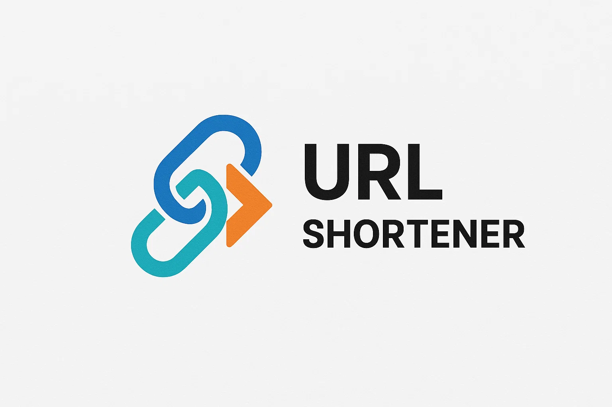

<p align="center">
  
</p>
# URL Shortener (Frontend)

A modern **React frontend** for a URL shortening app.
This project demonstrates a sleek UI for shortening URLs, live preview, and copy-to-clipboard functionality.

> You can find the backend code here:
> **[Backend Repository](https://github.com/jztchl/url_shortner_backend)**

---

## 🚀 Features

* Enter a URL and get a shortened version (requires backend)
* Live preview of shortened URL
* Copy-to-clipboard button
* Clear input easily
* Responsive card-style UI

---

## 💻 Tech Stack

* **Frontend:** React
* **Styling:** Plain CSS
* **HTTP Requests:** Axios

---

## ⚡ Installation & Setup

1. **Clone the frontend repository**

```bash
git clone https://github.com/yourusername/url-shortener-frontend.git
cd url-shortener-frontend
```

2. **Install dependencies**

```bash
npm install
```

3. **Configure backend URL**

* Create a `.env` file in the root of the project:

```env
VITE_BACKEND_URL=https://url-shortner.koyeb.app
```

4. **Start the frontend**

```bash
npm start
```

5. **Open in browser**

```
http://localhost:3000
```

---

## 🛠 Usage

1. Enter a full URL (including `https://`) in the input field.
2. Click **Shorten** (requires the backend running).
3. Your shortened URL will appear below the input.
4. Click **Copy** to copy the shortened URL to your clipboard.
5. Click **Clear** to reset and shorten another URL.

---

## 🔧 Folder Structure

```
frontend/
├─ src/
│  ├─ App.js          # Main App component
│  ├─ App.css         # Styles
│  └─ utils/
│     └─ apis.js      # Axios API calls
├─ public/
├─ package.json
└─ README.md
```

---

## 📜 License

This project is **MIT Licensed**.


Do you want me to do that?
